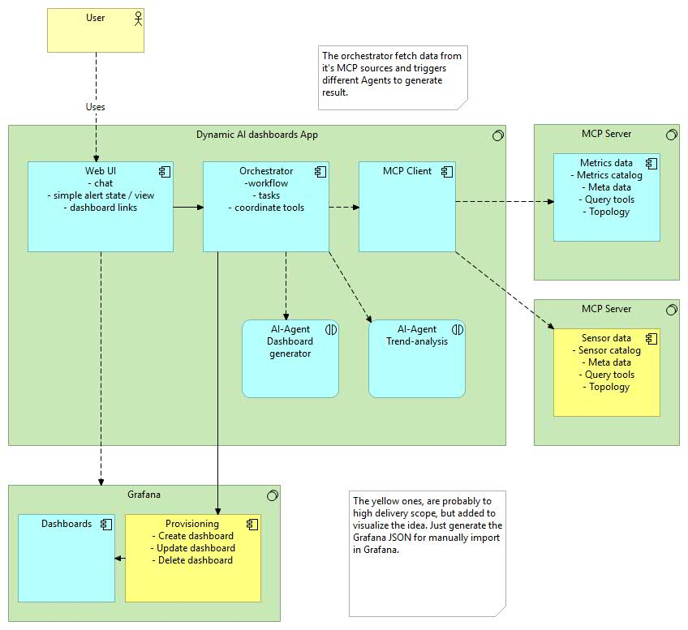

# Dynamic Dashboard - Team Working Document

> **How to read this document**
>
> 1. Read the **Arnt / Geir Feedback** section once for context (the *why*).
> 2. Then jump to the **Dynamic Dashboard Task Plan** section below the divider (the *how*).
> 3. Each person should mostly work from their own **Workstream A/B/C/D** section, not the whole 1000+ line file.
>
> One milestone owns this week:
> `POST /api/v1/dynamic/trigger` -> generated dashboard appears in Grafana under UID `maritime_dynamic_incident`.
>
> Jonas's chat hardening and Onu's runtime fixes are already on `main`. Do **not** redo them.

---

# Arnt / Geir Feedback - 2026-04-07

Context:
- Meeting on Teams with Jonas, Kristian, Nidal, Pheeraphan, Arnt, and Geir.
- Purpose: present the current prototype and get direction for the next presentation and remaining work.

## Main Message

Arnt and Geir are not primarily asking for a perfect or commercial-ready system.
They want the group to show:

- clear technical growth
- a convincing agentic AI concept
- a prototype that demonstrates feasibility
- a stronger story around dynamic dashboards, MCP, and workflow/actionability

The project should therefore be presented as:

- a working prototype
- an architecture for agentic observability
- a concept that can be extended into something more dynamic and intelligent

## What They Liked

- The project direction is interesting and relevant.
- The agentic AI angle is seen as the most exciting part.
- MCP is a strong concept and should be made visible in the presentation.
- The architecture and feasibility matter a lot for how the project is perceived.

## Main Concerns

### 1. Dashboard is not dynamic enough

The current Grafana dashboards do not visibly adapt based on incoming changes in
the way Arnt and Geir imagined when they talked about dynamic dashboards.

What they seem to want:
- stronger evidence that the system reacts to changing conditions
- a more dynamic and agent-driven story around dashboards
- a demo that shows adaptation, not only static visualization

### 2. AI understanding is too sensor-focused

The current LLM / knowledge setup appears to handle sensors better than
applications.

Examples from the feedback:
- the model can answer sensor-oriented questions more easily
- suggested actions are more sensor-oriented than application-oriented
- the solution becomes less interesting if it cannot also reason about apps and
  application health

### 3. The "agentic" part must be clearer

They want the AI-agent aspect to be much more visible in both the prototype and
the presentation.

Important angle:
- not just "we use an LLM"
- but "agents can observe, reason, coordinate work, and drive action/workflow"

## What They Seem To Want Next

### Near-term presentation goal

For the next presentation, the group should aim to show:

- the architecture
- the MCP role in the system
- how the prototype works today
- why the agentic AI approach is valuable
- a believable path toward dynamic dashboards

### Strong concept to explore

A suggested direction from the meeting was a two-agent concept:

- Agent 1: gathers or interprets metrics/data
- Agent 2: proposes or applies dashboard changes based on what Agent 1 found

This does not need to be a full production feature. Even a small, controlled
proof of concept could be valuable for the presentation.

### Possible demo-friendly experiment

The meeting suggested that the group may:

- create a fake dataset or controlled scenario
- let one agent analyze the dataset
- let another agent propose or trigger a dashboard change

The purpose is to demonstrate that the concept is feasible.

## Follow-up Email Clarification

After the meeting, Arnt sent a follow-up note together with a concept sketch.
The most important clarification was:

- the arrows in the sketch indicate who asks whom
- the arrows do not represent a strict one-way technical data flow
- the real data flow may often go both ways

This matters because the sketch should be read as a conceptual interaction map,
not as a final implementation diagram.

### What the sketch seems to add

The sketch makes the intended concept more concrete:

- a user interacts through a web UI
- an orchestrator coordinates tasks and tools
- an MCP client connects to one or more MCP servers
- separate AI agents may have distinct roles
- Grafana is still the dashboard surface, but AI can influence what gets shown
  or generated

The named agent roles in the sketch are especially useful for planning:

- AI agent for dashboard generation
- AI agent for trend analysis

This strengthens the interpretation that they want a clearer multi-step,
agent-coordinated story, not only a single chatbot answering questions.

### Important scope signal from the email

One note in the sketch is especially important:

- the yellow parts are likely too large in delivery scope
- they are included mainly to visualize the idea
- it is acceptable to generate Grafana JSON for manual import instead of
  building full automatic dashboard provisioning

This lowers the implementation bar for the next presentation.

In practice, a convincing proof of concept could be:

- agent reads metrics or a fake scenario through MCP-like inputs
- agent proposes a dashboard layout or update
- system outputs Grafana JSON
- the JSON is shown or manually imported into Grafana

That is enough to demonstrate feasibility without needing a complete end-to-end
dashboard mutation platform.

### What this likely means for tomorrow's task split

The follow-up email makes these work directions even clearer:

1. Orchestrator / workflow concept
- how one component coordinates tools and multiple agents

2. Dashboard-generation proof of concept
- how AI could output a Grafana dashboard or dashboard update

3. Trend-analysis or metrics-analysis agent
- how one agent can interpret inputs before another agent acts on them

4. Presentation clarity
- how to explain that this is a feasible architecture direction, even if the
  current prototype only implements part of it

### Repo note

The follow-up sketch is important for planning and presentation. It is now kept
in the repository at:

- `docs/images/arnt-geir-dynamic-dashboard-concept-2026-04-07.png`

Reference image:

## What Seems Most Important For The Group

If time is limited, the meeting suggests prioritizing:

1. A strong presentation narrative
2. A clearer agentic AI concept
3. A small but convincing dynamic-dashboard demonstration
4. Better application-level reasoning, if feasible

Not the top priority:
- making the whole platform perfect
- solving every known technical limitation before the presentation

## Suggested Workstreams For Task Planning

These are reasonable work buckets to divide tomorrow:

### 1. Dynamic Dashboard / Agent Concept

Goal:
- explore or prototype one small dynamic dashboard flow

Examples:
- fake dataset -> agent analysis -> suggested dashboard update
- metric change -> agent proposes changed dashboard focus

### 2. AI Knowledge / App Reasoning

Goal:
- make the AI less sensor-only and more application-aware

Examples:
- improve prompts or context
- improve application-related knowledge
- improve suggested actions for application incidents

### 3. Presentation / Storytelling

Goal:
- make the presentation clearly communicate value

Should cover:
- architecture
- MCP
- agentic workflow
- prototype demo
- what is already working
- what the dynamic concept adds

### 4. Demo Reliability

Goal:
- make sure the demo path is stable and easy to show

Examples:
- confirm which flow to demo
- define fallback demo paths
- prepare one "safe" scenario and one "wow" scenario

## Recommended Framing For The Presentation

The project should probably be framed as:

"We have built a working prototype for agentic maritime observability. The
current system already monitors incidents, uses MCP tools, and supports AI-based
analysis. The next step we are now pushing toward is a more dynamic and clearly
agent-driven dashboard workflow."

## Practical Takeaway

A good outcome before the next presentation would be:

- one stable demo flow that already works
- one clear explanation of MCP and architecture
- one visible example of agentic or dynamic behavior, even if limited

## Open Follow-up

- Geir will send a short document with additional improvements/changes.
- The group should use that together with this summary when assigning new tasks.

---

# Dynamic Dashboard Task Plan

## Project Overview

This project is a bachelor thesis in collaboration with Knowit.

We already have a large working observability system:
- Grafana dashboards for fleet, vessel, NOC, and trends
- FastAPI agent service
- MCP-style tool layer with 13 tools
- PostgreSQL + TimescaleDB
- Seeded maritime telemetry and application data
- RAG + local LLM through Ollama

The system currently works well as:
- static dashboards with live data
- AI analysis on top of dashboards
- MCP-style access to metrics, alerts, and logs

## Why We Are Pivoting

We misunderstood the main requirement.

We focused on:
- AI analysis on top of dashboards

The company actually wants:
- dashboards that adapt to what is happening now

The key idea is:
- the dashboard should show what matters now, not only what we predefined

That means the missing capability is not “more AI analysis”.
The missing capability is:
- incoming alert or warning
- system fetches context
- system classifies the situation
- system generates or updates a Grafana dashboard for that incident

We are not throwing away the current system.
We are adding one new layer on top of what already exists.

## What We Are Building

We are adding one new flow:

`alert/warning -> orchestrator -> MCP context -> scenario classification -> generated Grafana dashboard`

Scope for this sprint:
- one prototype
- one user story
- one generated dashboard

Target user story:
- User Story 1: Single Vessel Incident

Definition of “dynamic” for this prototype:
- when an incident occurs, the system creates or updates one Grafana dashboard
- the content of that dashboard depends on the situation

Important constraints:
- keep all existing dashboards as fallback
- do not rewrite the MCP server
- do not rewrite the static dashboards
- use Grafana HTTP API, not file provisioning
- do not let the LLM generate full Grafana JSON
- use deterministic logic and deterministic dashboard building

Stable generated dashboard UID:
- `maritime_dynamic_incident`

## Demo Scenario

We will demo one concrete scenario first.

Primary scenario:
- single-vessel application incident

Recommended first incident:
- connectivity or stale-data issue on one vessel
- or service-down / runtime-pressure issue on one vessel

Recommended default vessel/app pairs based on current seeded semantics:
- `IMO9300001` + `data-quality-processor` for connectivity/stale behavior
- `IMO9300002` + `uds-edge-parquet-sync` for service-down behavior
- `IMO9300003` + `time-series-processor` for degraded/runtime-pressure behavior

Demo flow:
1. Show the current static dashboard as baseline
2. Inject or select an incident
3. Call the dynamic trigger endpoint
4. Orchestrator fetches context through existing MCP tools
5. Scenario is classified
6. A new incident-focused dashboard is generated or updated in Grafana
7. Show the generated dashboard
8. Optionally drill back into existing dashboards for supporting context

## Shared Repo Facts

Current repo facts that all workstreams should use:
- existing Grafana datasource UID: `timescaledb`
- Grafana provisioning folder config already exists
- agent service already has DB, Ollama, MCP URL, and router wiring
- MCP tool layer already exposes enough context for incident generation
- UDS schema and seeded scenarios already exist
- existing dashboards should be treated as panel/query references, not rewritten

Important files to read before starting:
- `CLAUDE.md`
- `README.md`
- `docs/architecture.md`
- `docs/UDS_dashboard_spec.md`
- `docker-compose.yml`
- `grafana/provisioning/datasources/timescaledb.yaml`
- `services/agent/main.py`
- `services/mcp/main.py`
- `db/init/003_uds.sql`
- `db/seed/uds_seed.sql`

## Shared Rules For Everyone

- Do not implement a general platform for all three user stories
- Do not overengineer
- Do not introduce new services unless absolutely necessary
- Do not let the LLM generate full dashboard JSON
- Do not modify the MCP server for the core version
- Do not rewrite existing dashboards
- Keep file ownership clean to reduce merge conflicts
- Keep the first milestone extremely small:
  - `POST /api/v1/dynamic/trigger` -> dashboard appears in Grafana

## First Team Milestone

Phase 1 success means:
- a manual trigger endpoint exists
- it causes `maritime_dynamic_incident` to appear in Grafana
- this works even before automation or anomaly detection is added

Everything else comes after that.

---

# WORKSTREAM A: Grafana + Dashboard Builder

## Context

This workstream owns the Grafana write path and the generated dashboard structure.

The project already has several static dashboards in:
- `grafana/dashboards/`

Those dashboards are useful references for:
- panel types
- query shapes
- layout patterns
- drilldown links

This workstream creates the code that:
- talks to Grafana HTTP API
- builds the generated dashboard JSON in Python
- supports scenario-based panel selection

## Goal

Make it possible to create or update one Grafana dashboard with UID:
- `maritime_dynamic_incident`

The first version must be able to:
- build a valid dashboard payload
- send it to Grafana
- make it visible in the UI

## Responsibilities

You own:
- Grafana API client
- generated dashboard JSON builder
- stable dashboard UID and title
- panel composition logic
- scenario-specific panel selection

You are responsible for these scenarios:
- `service_down`
- `runtime_pressure`
- `connectivity`
- `generic_incident`

You are also responsible for making sure the dashboard:
- uses datasource UID `timescaledb`
- includes a clear incident summary panel
- includes context and drilldown links
- stays deterministic and valid

## Files To Create / Modify

Create:
- `services/agent/dynamic/__init__.py`
- `services/agent/dynamic/grafana_client.py`
- `services/agent/dynamic/dashboard_builder.py`

You may read but should not modify existing dashboards during the first implementation phase:
- `grafana/dashboards/uds_monitoring.json`
- `grafana/dashboards/noc_support.json`
- `grafana/dashboards/fleet_overview.json`

## What NOT To Touch

Do not touch:
- `services/mcp/main.py`
- `services/agent/routes/analyze.py`
- `services/agent/routes/chat.py`
- `services/agent/routes/events.py`
- `db/init/`
- existing `grafana/dashboards/*.json`
- project docs

Do not introduce:
- file-based dashboard generation as the main write path
- LLM-generated full JSON
- Jinja2 unless absolutely necessary later

## Deliverables

The following must be working:
- a Grafana client that can:
  - check health
  - locate folder if needed
  - upsert dashboard with `POST /api/dashboards/db`
- a dashboard builder that can create one valid dashboard payload for each scenario
- a stable dashboard with UID `maritime_dynamic_incident`
- dashboard contents must include:
  - a text/summary panel
  - an incident context table
  - a vessel application-status view
  - a recent alerts or timeline view
  - a recent logs view
  - scenario-specific metric panels
  - links back to the static incident/NOC dashboards

## Step-by-Step Plan

1. Read these files first:
   - `docker-compose.yml`
   - `grafana/provisioning/datasources/timescaledb.yaml`
   - `docs/UDS_dashboard_spec.md`
   - `grafana/dashboards/uds_monitoring.json`
   - `grafana/dashboards/noc_support.json`

2. Create `grafana_client.py`
   - read Grafana URL and credentials from env
   - implement health check
   - implement folder lookup
   - implement dashboard upsert

3. Create the smallest possible dashboard payload first
   - title
   - one text panel
   - one table panel

4. Make sure the payload is valid for Grafana 11 and references `timescaledb`

5. Create `dashboard_builder.py`
   - one function that builds the full dashboard payload
   - one scenario mapping for each of:
     - `service_down`
     - `runtime_pressure`
     - `connectivity`
     - `generic_incident`

6. For each scenario, define exactly which panel groups appear
   - do not make this dynamic with LLM
   - use explicit Python mapping

7. Hand Workstream B a stable interface
   - one function to build payload
   - one function to upsert payload

## How To Use Your AI

Tell Codex/Claude:
- “This is a deterministic dashboard-generation task.”
- “Do not use the LLM to generate Grafana JSON.”
- “Use our existing dashboards as structural references.”
- “Use env vars from `docker-compose.yml` and `.env`, do not hardcode secrets.”
- “The first milestone is only: upsert one working dashboard to Grafana.”

Ask your AI for:
- valid Grafana dashboard payload shape
- clean Python dict builders
- small reusable helper functions

Do not ask your AI to:
- redesign the dashboard system
- create multiple generated dashboards
- touch the MCP layer
- modify static dashboards in phase 1

---

# WORKSTREAM B: Orchestrator + API

## Context

This workstream owns the new dynamic flow inside the existing `agent` service.

The `agent` service already has:
- FastAPI routing
- DB access
- Ollama client
- HTTP-based access to the MCP-style server
- patterns for route design in:
  - `services/agent/routes/analyze.py`
  - `services/agent/routes/chat.py`

This workstream adds:
- the trigger endpoint
- the status endpoint
- MCP context gathering
- scenario classification
- orchestration into Workstream A’s builder/upsert flow

## Goal

Create the new dynamic API path so that:
- a user or demo script can trigger generation
- context is fetched through existing MCP tools
- the incident is classified
- a dashboard is built and pushed to Grafana

## Responsibilities

You own:
- new route module
- request and response models
- MCP HTTP client wrapper
- scenario classifier
- orchestrator logic
- optional summary-text generation
- run logging integration

You also own the central decision flow:
- explicit context mode
- latest firing alert mode
- dry-run mode

## Files To Create / Modify

Create:
- `services/agent/dynamic/mcp_client.py`
- `services/agent/dynamic/scenario_selector.py`
- `services/agent/dynamic/orchestrator.py`
- `services/agent/routes/dynamic_dashboard.py`

Modify:
- `services/agent/main.py`

Optional only if needed:
- `services/agent/models.py`

## What NOT To Touch

Do not touch:
- `services/mcp/main.py`
- existing `grafana/dashboards/*.json`
- `services/agent/routes/analyze.py` except as a read-only reference
- `services/agent/routes/chat.py` except as a read-only reference
- docs files
- seed scripts

Do not introduce:
- direct SQL for the main incident context flow
- background polling before manual triggering works
- a new microservice

## Deliverables

The following must be working:
- `POST /api/v1/dynamic/trigger`
- `GET /api/v1/dynamic/status`

`POST /api/v1/dynamic/trigger` must support:
- `mode: explicit_context`
- `mode: latest_firing_alert`
- `dry_run: true/false`

Request fields must support:
- `vessel_imo`
- `app_external_id`
- `alert_name`
- `severity`
- `source_alert_fingerprint`
- `mode`
- `dry_run`

Response must include:
- `dashboard_uid`
- `dashboard_url`
- `scenario_key`
- `trigger_mode`
- `generated_at`
- `summary`
- `used_tools`

Scenario classification must support:
- `service_down`
- `runtime_pressure`
- `connectivity`
- `generic_incident`

The main context must come from existing MCP tools such as:
- `get_vessel_app_status`
- `get_vessel_alerts`
- `get_app_metric_history`
- `get_app_logs`
- `get_incident_timeline`
- `get_operational_snapshot`

## Step-by-Step Plan

1. Read these files first:
   - `services/agent/main.py`
   - `services/agent/db.py`
   - `services/agent/llm/ollama_client.py`
   - `services/agent/routes/analyze.py`
   - `services/agent/routes/chat.py`
   - `services/mcp/main.py`

2. Create `dynamic_dashboard.py`
   - define request/response models
   - define the two endpoints
   - do not add background behavior yet

3. Create `mcp_client.py`
   - build a minimal wrapper around current MCP HTTP endpoints
   - use the MCP API key from env
   - keep the interface simple

4. Create `scenario_selector.py`
   - map alert names/types deterministically to:
     - `service_down`
     - `runtime_pressure`
     - `connectivity`
     - `generic_incident`

5. Create `orchestrator.py`
   - load context from MCP
   - call scenario selector
   - build a context object for Workstream A
   - optionally generate summary text
   - if not dry run, call Workstream A Grafana upsert
   - log the run to the DB table from Workstream C

6. Make `explicit_context` mode work first
   - this is the first milestone

7. Only after that, add `latest_firing_alert`
   - pull the latest active alert through MCP or the minimal existing path
   - feed it through the same orchestrator

8. Leave background polling out of phase 1
   - only add later if the end-to-end path is already stable

## How To Use Your AI

Tell Codex/Claude:
- “This task is about orchestration, not UI polish.”
- “Reuse route patterns from `analyze.py` and `chat.py`.”
- “Use Pydantic validation and explicit response shapes.”
- “Use MCP HTTP calls for incident context, not direct SQL for the main path.”
- “The first milestone is `explicit_context` mode.”

Ask your AI for:
- clean request/response models
- clear orchestration flow
- safe error handling
- deterministic scenario mapping

Do not ask your AI to:
- create a general agent framework
- redesign the MCP server
- build automation first
- use the LLM for classification when rules are enough

---

# WORKSTREAM C: Demo Data + Injection

## Context

This workstream makes the demo reliable.

The repo already has seeded UDS scenarios, but the team needs a way to trigger a known incident on demand so the generated dashboard can be demonstrated repeatedly and safely.

This workstream also adds one small logging table so dynamic dashboard runs can be tracked.

## Goal

Create one deterministic way to trigger a single-vessel incident and one DB table to record dynamic dashboard runs.

The first version should make the demo reliable before it tries to be smart.

## Responsibilities

You own:
- the run-logging SQL init script
- the incident injection script
- the exact demo scenario defaults
- the short demo runbook used by the team

You are responsible for making sure the other workstreams can test against a known scenario.

## Files To Create / Modify

Create:
- `db/init/005_dynamic_dashboard_runs.sql`
- `scripts/inject_dynamic_incident.py`
- `docs/DYNAMIC_DASHBOARD_DEMO.md`

Optional only if needed later:
- `.env.example`

## What NOT To Touch

Do not touch:
- `services/mcp/main.py`
- `services/agent/routes/*`
- `services/agent/dynamic/*`
- existing `grafana/dashboards/*.json`
- main project docs in phase 1

Do not introduce:
- random incident generation as the primary demo path
- new permanent services
- schema changes outside the one logging table

## Deliverables

The following must be working:
- `005_dynamic_dashboard_runs.sql` creates a table for dynamic runs
- `inject_dynamic_incident.py` can create a known incident on demand
- the script supports at least:
  - `service_down`
  - `connectivity`
- optional third mode:
  - `runtime_pressure`
- `docs/DYNAMIC_DASHBOARD_DEMO.md` contains:
  - exact commands
  - expected result
  - fallback steps

Recommended table columns:
- `id`
- `created_at`
- `trigger_mode`
- `source_alert_fingerprint`
- `vessel_imo`
- `app_external_id`
- `alert_name`
- `severity`
- `scenario_key`
- `dashboard_uid`
- `summary`
- `used_tools_json`
- `dashboard_json`

Recommended default demo mappings:
- `service_down`
  - `IMO9300002`
  - `uds-edge-parquet-sync`
- `connectivity`
  - `IMO9300001`
  - `data-quality-processor`
- optional `runtime_pressure`
  - `IMO9300003`
  - `time-series-processor`

## Step-by-Step Plan

1. Read these files first:
   - `db/init/003_uds.sql`
   - `db/seed/uds_seed.sql`
   - `docs/SCOPE1_ACCEPTANCE_CHECKLIST.md`
   - `docs/architecture.md`

2. Create `005_dynamic_dashboard_runs.sql`
   - keep schema small
   - only support what Workstream B needs to log

3. Study existing seeded scenario semantics in `uds_seed.sql`
   - reuse current alert names/types where possible

4. Build `inject_dynamic_incident.py`
   - use `asyncpg`
   - use parameterized inserts only
   - start with `service_down`
   - then add `connectivity`
   - add `runtime_pressure` only if time remains

5. Make sure the injected incident is easy to map to Workstream B’s scenario rules

6. Write `docs/DYNAMIC_DASHBOARD_DEMO.md`
   - one primary demo flow
   - one fallback flow using `explicit_context`

## How To Use Your AI

Tell Codex/Claude:
- “This task is about deterministic demo support.”
- “Reuse existing UDS semantics and scenario naming.”
- “Use `asyncpg` and parameterized SQL only.”
- “Start with one bulletproof incident mode, then add the second.”
- “Do not invent new vessel IDs or application IDs.”

Ask your AI for:
- safe SQL init file
- clean CLI argument parsing
- reliable insert logic
- exact demo commands

Do not ask your AI to:
- redesign the schema
- make a complex simulator
- change MCP
- change Grafana

---

# WORKSTREAM D: Presentation + Story

## Context

The project story has changed.

Before:
- dashboards + AI analysis

Now:
- existing observability platform + new dynamic incident dashboard layer

This workstream makes sure the project is communicated clearly to:
- Arnt
- Geir
- the bachelor presentation audience

The goal is not to oversell.
The goal is to explain the pivot honestly and show one convincing prototype.

## Goal

Produce a clear architecture and demo story that explains:
- what the project already had
- what requirement was misunderstood
- what the new dynamic dashboard layer adds
- why this now better matches the thesis question and company feedback

## Responsibilities

You own:
- the updated architecture wording
- the dynamic dashboard story
- the demo script for the new flow
- fallback screenshots / backup plan
- presentation-friendly explanation of the MCP role

You are responsible for making the prototype understandable and credible.

## Files To Create / Modify

Modify:
- `README.md`
- `docs/architecture.md`
- `docs/PRODUCTION_GUIDE.md`
- `docs/DEMO_SCRIPT.md`

Create:
- `docs/DYNAMIC_DASHBOARD_PRESENTATION.md`

Optional later:
- `CLAUDE.md`

## What NOT To Touch

Do not touch:
- any runtime code
- DB init files
- scripts
- dashboard JSON files
- MCP code
- agent code

Do not claim:
- full production readiness
- all user stories are dynamically generated
- official MCP compliance if the implementation is still MCP-style REST
- fully autonomous self-learning dashboards

## Deliverables

The following must be ready:
- updated project narrative in docs
- architecture text that includes:
  - Web UI
  - Orchestrator
  - MCP context fetch
  - Scenario classification
  - Dashboard generation
  - Grafana update
- updated demo script with:
  - baseline dashboard
  - injected incident
  - trigger endpoint
  - generated dashboard
  - fallback drilldown
- one presentation helper document that includes:
  - key speaking points
  - exact demo flow
  - fallback flow if the live demo fails

## Step-by-Step Plan

1. Read these files first:
   - `README.md`
   - `docs/architecture.md`
   - `docs/PRODUCTION_GUIDE.md`
   - `docs/DEMO_SCRIPT.md`
   - the meeting notes and Arnt’s image summary

2. Write the new story in one sentence first:
   - “We are adding a dynamic dashboard generation layer on top of the existing observability platform.”

3. Update `docs/architecture.md`
   - make the new flow visible
   - keep the old dashboards as the baseline foundation

4. Update `README.md`
   - describe the new generated dashboard path
   - keep scope honest and small

5. Wait until Workstreams A–C stabilize the actual behavior
   - then update `docs/DEMO_SCRIPT.md`

6. Create `docs/DYNAMIC_DASHBOARD_PRESENTATION.md`
   - architecture summary
   - demo script
   - speaking points
   - fallback screenshots plan

7. Update `docs/PRODUCTION_GUIDE.md` only after the implementation details are stable

## How To Use Your AI

Tell Codex/Claude:
- “This is a documentation and presentation task.”
- “Ground everything in the current repo and the new pivot.”
- “Keep the story honest and technically credible.”
- “The focus is one strong prototype for User Story 1.”
- “Do not oversell beyond what the implementation actually supports.”

Ask your AI for:
- concise architecture wording
- cleaner README explanations
- a step-by-step demo script
- presentation notes with strong but honest phrasing

Do not ask your AI to:
- invent new features
- write marketing fluff
- imply the whole system was rebuilt
- promise all three user stories are fully dynamic now

---

# Cross-Team Dependency Order

## Day 1 priority
- Workstream A: Grafana upsert must work
- Workstream B: trigger route skeleton and explicit-context flow
- Workstream C: logging table and one incident-injection mode
- Workstream D: architecture and presentation draft structure

## Day 2 priority
- Workstream A + B integration
- Workstream C verifies a reproducible incident
- Workstream D updates narrative based on the real flow

## Day 3 priority
- scenario-based dashboard content
- latest firing alert mode
- first full demo run

## Day 4 priority
- polish
- fallback screenshots/video
- demo repetition

## Day 5 priority
- final dry runs
- no major new features

## Shared Success Criteria

Phase 1 success:
- `POST /api/v1/dynamic/trigger` works
- `maritime_dynamic_incident` appears in Grafana

Phase 2 success:
- scenario changes dashboard content

Phase 3 success:
- a real incident or injected incident can drive the flow end-to-end

Final demo success:
- the team can show:
  - baseline
  - incident trigger
  - generated dashboard
  - supporting static dashboards as fallback context
